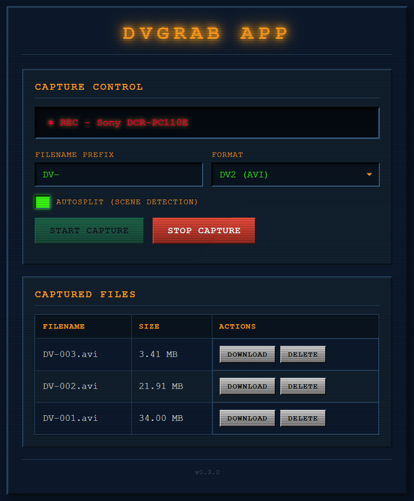

# dvgrab APP

A containerized web-based UI for capturing DV video from your favorite FireWire-connected camcorders straight from the glory 90ies using dvgrab.

## Features

- **Web-based control** - Start/stop capture from any browser
- **Multiple formats** - DV2 (AVI), DV1, RAW, QuickTime MOV
- **Autosplit** - Automatic scene detection and file splitting
- **File management** - Download and delete captured files via web UI
- **Live status** - Real-time capture status updates
- **Device detection** - Auto-detects connected camcorder with vendor/model info
- **PWA support** - Install as a standalone app on your device
- **Headless-friendly** - Perfect for servers without displays
- **Retro CRT-style UI** - Nostalgic interface with scanlines and LCD aesthetics

## Screenshot



## Requirements

- Linux system with FireWire (IEEE 1394) port
- DV camcorder with FireWire connection
- Docker and Docker Compose
- FireWire kernel modules loaded (`firewire_ohci`, `firewire_core`)

## Hardware Compatibility

**Works with any OHCI-compliant FireWire controller.** Virtually all FireWire cards follow the OHCI (Open Host Controller Interface) standard, so you don't need to worry about specific card compatibility.

- The Linux kernel automatically detects and supports any OHCI-compliant FireWire card
- Common chipsets (TI, VIA, NEC, Agere, etc.) all work out of the box
- The `/dev/fw0` device is created automatically regardless of card manufacturer

**Multiple FireWire devices:** If you have multiple FireWire cards or devices, you may see `/dev/fw0`, `/dev/fw1`, etc. Adjust the device path in `docker-compose.yml` if needed.

## Installation

### 1. Clone the repository

```bash
git clone https://github.com/henniiiing/dvgrab-WebUI.git
cd dvgrab-WebUI
```

### 2. Build and run with Docker Compose

```bash
docker compose up -d --build
```

### 3. Access the web UI

Open your browser and navigate to:
```
http://<your-server-ip>:5151
```

## Usage

1. Connect your DV camcorder via FireWire cable
2. Set camcorder to **Play/Edit** mode (or **Camera** mode for live capture)
3. Open the web UI at `http://<your-ip>:5151`
4. Enter a filename prefix (e.g., `vacation-2024-`)
5. Select output format (DV2/AVI recommended)
6. Enable **Autosplit** if you want automatic scene detection
7. Click **Start Capture**
8. Click **Stop Capture** when done
9. Download your files from the file list

## Configuration

### Port

Change the port in `docker-compose.yml`:
```yaml
ports:
  - "5151:5000"  # Change 5151 to your preferred port
```

### Capture output directory

Files are saved to `/captures` inside the container. To change the host directory:

```yaml
volumes:
  - /path/to/your/captures:/captures
```

### FireWire device

If you have multiple FireWire devices, change the device path in `docker-compose.yml`:

```yaml
devices:
  - /dev/fw1:/dev/fw0  # Use fw1 instead of fw0
```

Check which device your camcorder is connected to:
```bash
ls -la /dev/fw*
```

### File Formats

| Format | Extension | Description |
|--------|-----------|-------------|
| DV2 | `.avi` | DV Type 2 AVI (recommended) |
| DV1 | `.avi` | DV Type 1 AVI |
| RAW | `.dv` | Raw DV stream |
| MOV | `.mov` | QuickTime format |

## API Endpoints

| Endpoint | Method | Description |
|----------|--------|-------------|
| `/` | GET | Web UI |
| `/api/start` | POST | Start capture |
| `/api/stop` | POST | Stop capture |
| `/api/status` | GET | Get capture status |
| `/api/device` | GET | Get camcorder connection status |
| `/api/files` | GET | List captured files |
| `/api/download/<filename>` | GET | Download a file |
| `/api/delete/<filename>` | DELETE | Delete a file |

### API Examples

**Start capture:**
```bash
curl -X POST http://localhost:5151/api/start \
  -H "Content-Type: application/json" \
  -d '{"prefix": "myvideo-", "format": "dv2", "autosplit": true}'
```

**Stop capture:**
```bash
curl -X POST http://localhost:5151/api/stop
```

**Get status:**
```bash
curl http://localhost:5151/api/status
```

**Get device info:**
```bash
curl http://localhost:5151/api/device
```

## Troubleshooting

### No camera detected

1. Verify FireWire device is present:
   ```bash
   ls -la /dev/fw*
   ```

2. Check kernel modules:
   ```bash
   lsmod | grep firewire
   ```

3. Ensure camcorder is powered on and in Play/Edit mode

### Permission denied on /dev/fw0

The container runs in privileged mode. If you still have issues:
```bash
sudo chmod 666 /dev/fw0
```

### Container won't start

Check logs:
```bash
docker compose logs -f
```

## Tech Stack

- **Python 3.11** - Runtime
- **Flask** - Web framework
- **dvgrab** - DV capture tool (bundled in container)
- **Docker** - Containerization

## Based on

- [dvgrab](https://github.com/ddennedy/dvgrab) - The underlying capture tool

## License

MIT License
